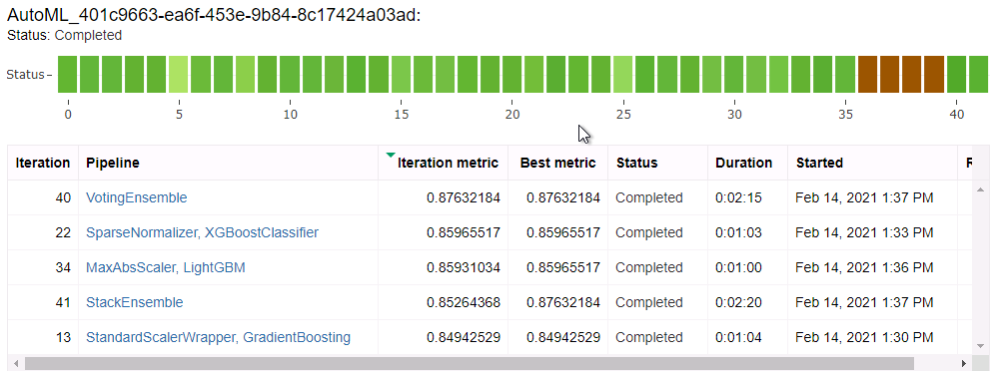

# Capstone Project

## Project Overview

The capstone project is the last part of the Azure Nanodegree Program, Machine Learning Engineer with Microsoft Azure. For this project, we were required to find an external dataset and use machine learning methods to make predictions. So we used the heart failure records data that exist in Kaggle, and applied machine learning methods to it to predict the likelihood of survival of a patient who has heart failure problems. To do this, we used AutoML and another custom model that uses Logistic regression and selected the best model based on the primary metric we defined, which we defined as accuracy and compared the two models based on this. 

## Dataset

## Overview and Task

For this project, we used the data on heart failure records from Kaggle. The file contains information on 299 patients who were treated at a hospital in Punjab region of Pakistan betweeen April and December 2015. Out of the 299 patients, 105 were women and 194 were men. The age range is between 40 and 95 years old. There are additional data points on patients in the dataset that include the chronic conditions they have (diabetes, anemia, high blood pressure, smoking), levels of certain blood cells and minerals in the blood (CPK, platelets, serum creatinine, serum sodium), blood ejection fraction, follow-up days and whether the patient died during follow-up. The task was to use these various features to predict the likelihood of patient's passing during the follow-up period. 

## Access
I downloaded the csv file from [Kaggle!](https://www.kaggle.com/andrewmvd/heart-failure-clinical-data). Then we uploaded it to the workspace, saved it as a tabular dataset and set the column names. For AutoML experiment, we read this file from the workspace. For our hyperdrive experiment, we accessed it using the Github directory and converted it to dataframe for experimental purposes.

## Automated ML:
## Settings and Configuration

Below are the settings and configuration for AutoML experiment:

- 5 concurrent iterations
- Primary metric defined as accuracy
- Task defined as classification
- Early stopping enabled as Bandit Policy

I chose the settings to make sure the experiment ran correctly but also did not waste resources. I chose a timeout of 20 minutes to limit the time of the experiments and 5 as the maximum number oc concurrent iterations to limit the resources. I chose the primary metric accuracy, as it was easy to work for both automl and hyperdrive in the time I had - AUC could have been better. My task was a classification task. Early stopping as True is designed to save resources with Bandit policy. BanditPolicy is used here which is an "aggressive" early stopping policy. It is preferrable because it prevents more runs compared to more conservative policies and saves more computational time. 

## Results:
The best model from AutoML was the one that used VotingEnsemble, which is a amalgam of different models, with an accuracy of 88%. Below are the details of the primary metric and the parameters of the model:

Below is a list of all metrics:

                                                                                                min_child_weight=1,
                                                                                                min_split_gain=0.2631578947368421,
                                                                                                n_estimators=50,
                                                                                                n_jobs=1,
                                                                                                num_leaves=104,
                                                                                                objective=None,
                                                                                                random_state=None,
                                                                                                reg_alpha=0,
                                                                                                reg_lambda=0.42105263157894735,
                                                                                                silent=True,
                                                                                                subsample=1,
                                                                                                subsample_for_bin=200000,
                                                                                                subsample_freq=0,
                                                                                                verbose=-10))],

Accuracy
0.87966
AUC macro
0.91676
AUC micro
0.92262
AUC weighted
0.91676
Average precision score macro
0.90703
Average precision score micro
0.92596
Average precision score weighted
0.92974
Balanced accuracy
0.84759
F1 score macro
0.85448
F1 score micro
0.87966
F1 score weighted
0.87454
Log loss
0.37420
Matthews correlation
0.73514
Norm macro recall
0.69519
Precision score macro
0.89153
Precision score micro
0.87966
Precision score weighted
0.89391
Recall score macro
0.84759
Recall score micro
0.87966

Here is a snapshot of AutoML widgets:

## Hyperparameter Tuning:
We chose Sci-kit learn logistic regression classifier for this model as the AutoML used classification. For this model, we tuned 2 hyperparameters: C and max_iter. Parameter C is the inverse of regularization strength, meaning it controls the regularization in a model, and we tested it using a sample space from 0.001 to 1000. Max_iter is the maximum number of iterations for the model to converge. We used random sampling. Below are the actual values we used for the experiment:

C: The inverse of the reqularization strength. '--C' : choice(0.001,0.01,0.1,1,10,20,50,100,200,500,1000),
max_iter: Maximum number of iterations to converge. '--max_iter': choice(50,100,300)

## Results:
The model achieved an accuracy of 81%. The parameter results from the hyperdrive are: ['--C', '0.1', '--max_iter', '100'].

## Deployed model and instructions on how to query the endpoint with a sample input
We selected the model to deploy based on the primary metric, so we selected the autoML model as it had a higher accuracy of 88%. 
To deploy the model, we used the interface for deployment. We deployed the AutoML using ACI. A REST API is produced at the end of deployment, which provides scoring uri with keys for authentication. We passed test data in a json file and provided a response in expected format (1,0) to validate deployment.

## Project Improvements

Here is a list of some suggestions for project improvement in the future:

1) Choosing a more powerful computer cluster to increase the concurrent iterations.

2) Improve the dataset by adding more data so that we get more allocated to training and test datasets. 

3) Tune more parameters in hyperdrive experiment

4) Try Bayesian Parameter sampling for speed purposes

##Screen Recording
*Youtube Link* -  - This is a video [screencast](https://www.youtube.com/watch?v=umoGFVxqQRQ&feature=youtu.be) of my going through the screenshots and the flow of the project. 

